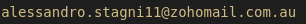

# ChatOverflow
ChatGPT driven technical support search engine

## How to deploy

Make sure you have a compatible version of Python and Pip compatible with the requirements for each lambda.
Run the `deploy.sh` script against the AWS account you want to deploy the stack in.

## How to index documents

If you want to contribute to my ChatOverflow, you can upload your EXCLUSIVELY about coding chats with ChatGPT on [this website](https://chatoverflow.retool.com/embedded/public/f07fa3a5-8f91-4011-8d7f-1217d4a79ee6)
 
You will need a password to access the website:
Contact us at .

# Roadmap
- Terraform state remotely stored
- [x]Deployment instructions
- [x]Chunk driven Indexing
- [ ]Capability of seeing full conversation
- [ ]Better Testing UI
- [ ]Deploy search website online
- [ ]Show partial conversation text. Link to full conversation.
- [ ]User login and metadata on user who uploads.

